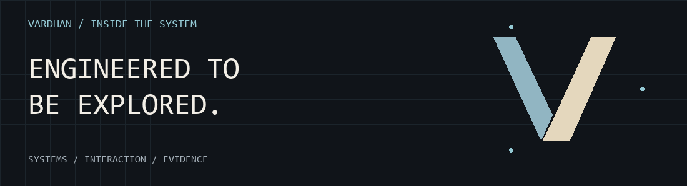
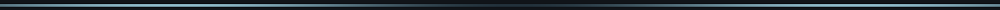
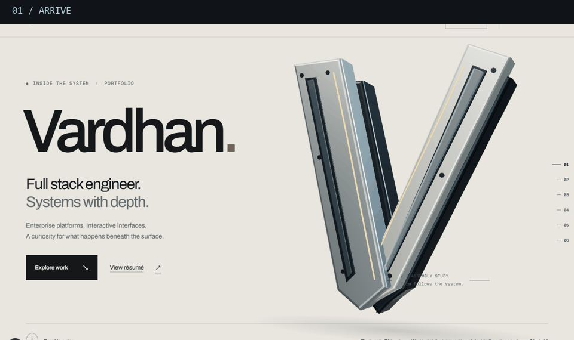
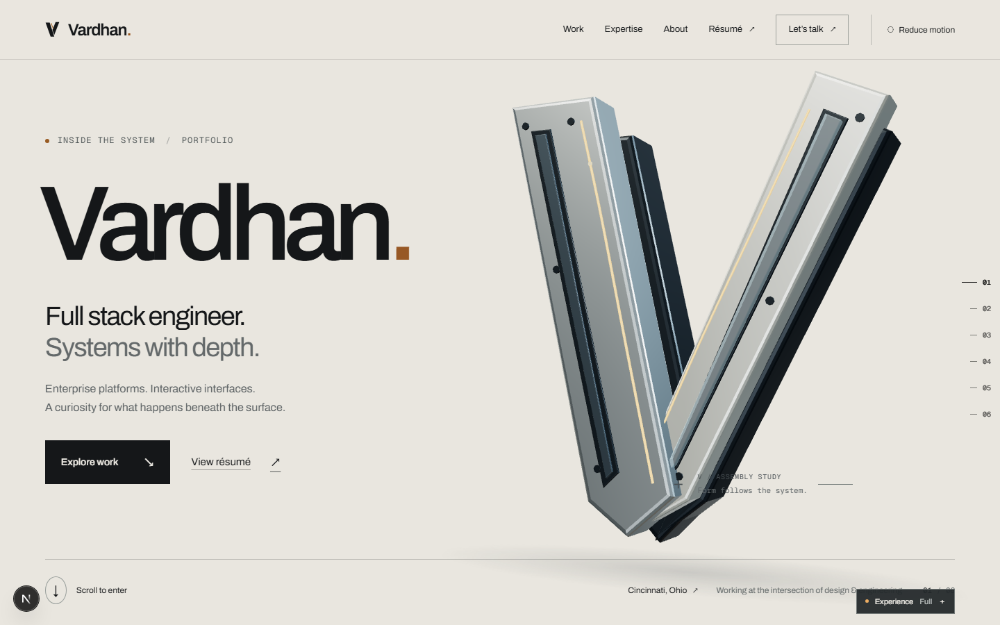
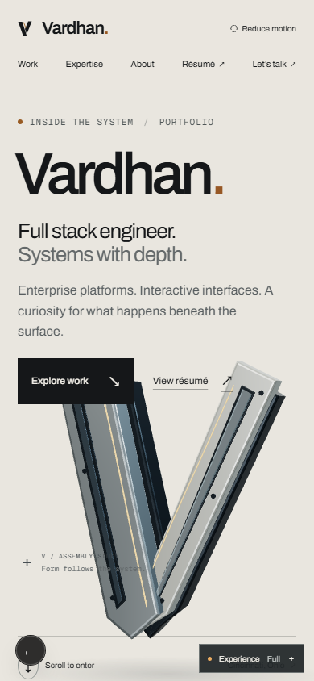
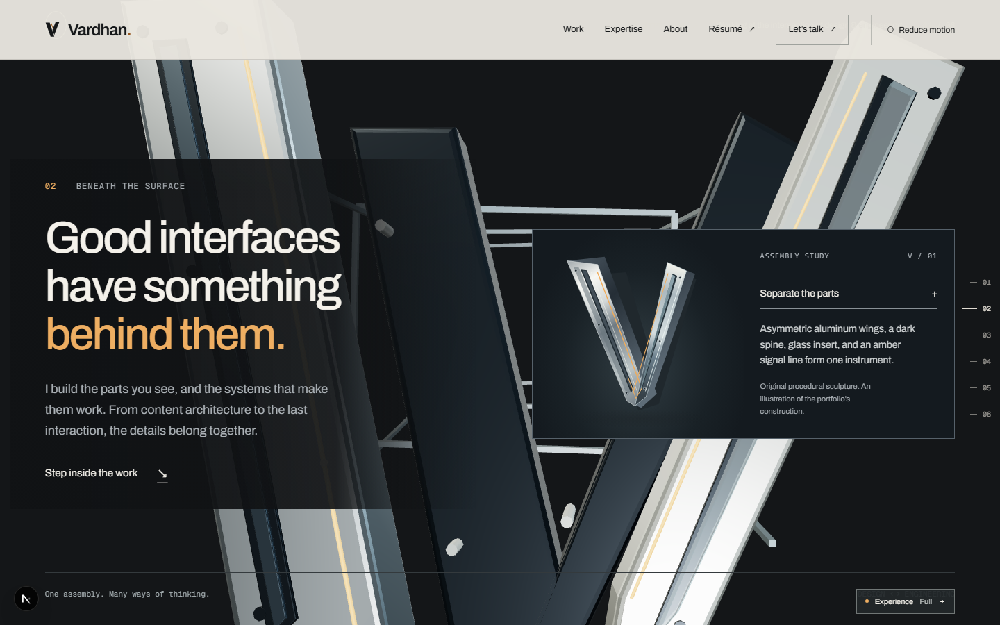
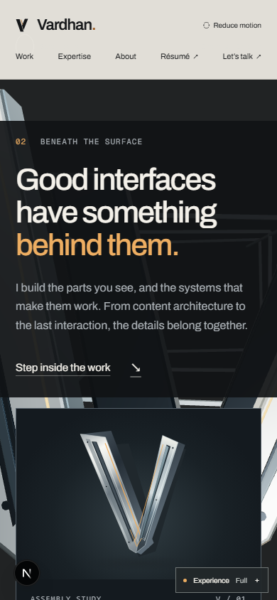
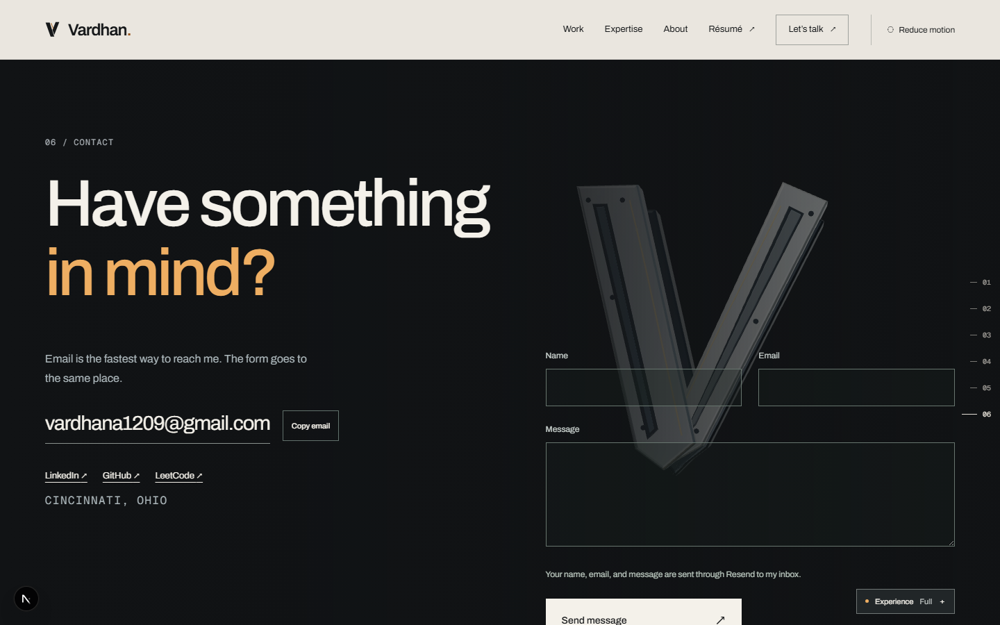
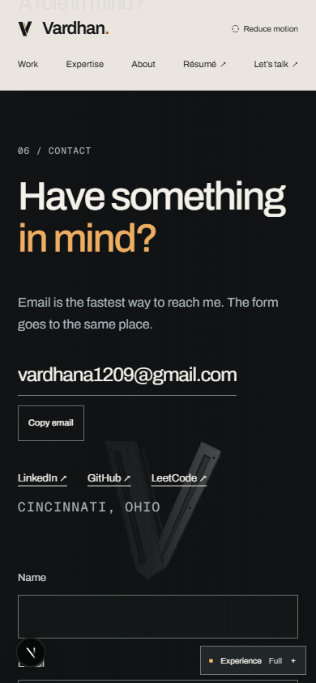
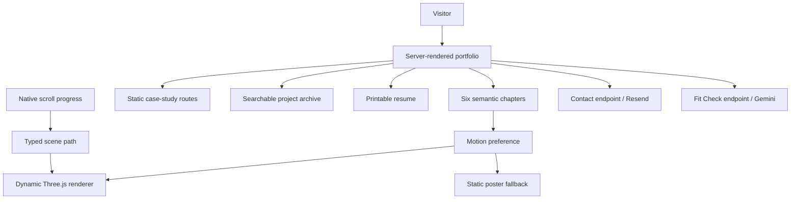

<div align="center">



# Vardhan / Inside the System

**A portfolio you move through. A system you can inspect.**

An original metal V. Six chapters. Six projects. One continuous journey.

[](package.json)
[](package.json)
[](tsconfig.json)
[](src/components/experience/)

[The experience](#the-experience) · [Launch sequence](#launch-sequence) · [Architecture](#under-the-surface) · [Verification](#verification-console)

</div>



## The experience

Native scrolling separates the V assembly, travels through its opening, reveals project exhibits, and resolves into a quiet signature beside contact. Readable, server-rendered HTML carries the portfolio independently of the decorative canvas.



*A looping sequence of real local browser captures. This is a screenshot tour, rather than a live scrolling recording. [Original captures](docs/evidence/review/).*

| Chapter | What unfolds |
| :--- | :--- |
| **01 · Arrival** | The metal assembly introduces the visual identity. |
| **02 · Unfold** | Scroll progress separates its components and opens the scene. |
| **03 · Work** | Featured projects become exhibits with direct case-study routes. |
| **04 · Capabilities** | The engineering story connects implementation to decisions. |
| **05 · About** | Background and experience remain accessible as page content. |
| **06 · Contact** | A signature, contact form, and direct email path finish the journey. |

<details>
<summary><strong>Open the visual contact sheet</strong></summary>

| Desktop | Mobile |
| :---: | :---: |
|  |  |
|  |  |
|  |  |

</details>

## Designed to keep moving

- **Full, Balanced, and Static modes** share the same content and routes.
- **One decorative canvas** has a single camera owner and dynamically loaded rendering.
- **Idle and hidden-page pauses** prevent unnecessary continuous rendering.
- **Poster fallbacks and graphics retry** keep navigation useful when graphics fail.
- **Direct case-study routes** support refreshes and exploration outside the homepage.
- **A searchable archive and printable résumé** provide practical ways to review the work.

The README uses locally stored animated GIFs, expandable panels, linked badges, and a Mermaid diagram. GIF playback is controlled by the viewer; the site's motion preferences apply to the website.


## Six projects, six stories

Each case study records the problem, implementation, decisions, evidence, and limitations. Descriptions follow the reviewed source code in [the project catalog](src/content/portfolio.ts).

| Project | Focus | Local route |
| :--- | :--- | :--- |
| **Java Native RAG** | Java retrieval pipeline, vector search, and source metadata | `/work/java-native-rag` |
| **Chroma Loop** | Canvas arcade mechanics, deterministic challenges, and input | `/work/chroma-loop` |
| **Anon DApp** | Browser vault prototype with local storage and optional remote upload | `/work/anon-dapp` |
| **Aura Landing** | Responsive product-concept landing page | `/work/aura-landing` |
| **PDF Editor Tool** | Command-line scaffold for planned PDF operations | `/work/pdf-editor-tool` |
| **Blockchain Storage** | Educational local ledger and file-upload experiment | `/work/blockchain-storage` |

<details>
<summary><strong>What the evidence establishes</strong></summary>

The portfolio distinguishes screenshots from explanatory diagrams, prototypes from production systems, and implemented behavior from planned features. The PDF tool is a command scaffold; the blockchain project stores files locally; retrieval quality is not represented by unverified benchmark scores. See the [content audit](docs/content-audit.md) for the source review and corrections.

</details>

## Launch sequence

Use **Node.js 22 or newer** and npm. The application lives at this repository's root.

```bash
git clone https://github.com/grammerpro/vardhan-portfolio.git
cd vardhan-portfolio
git switch redesign/instrument
npm ci
npm run dev
```

Open [localhost:3000](http://localhost:3000). For a production preview:

```bash
npm run build
npm run start
```

<details>
<summary><strong>Connect the optional integrations</strong></summary>

Copy [.env.example](.env.example) to `.env.local` if you need provider-backed features. Preserve existing local values.

| Setting | Purpose |
| :--- | :--- |
| `RESEND_API_KEY` | Contact email provider credential |
| `CONTACT_TO_EMAIL` | Owner-controlled destination mailbox |
| `CONTACT_FROM_EMAIL` | Optional verified sender |
| `GEMINI_API_KEY` | Fit Check embedding and assessment provider |

The portfolio and direct email link work without these settings. Fit Check sends submitted role text to Gemini; unavailable providers return error states. Keep credentials server-side. Verification scripts mock provider calls.

The fit retriever temporarily excludes ten stale evidence entries. Review the [content audit](docs/content-audit.md) before deliberately rebuilding paid embeddings.

</details>

## Under the surface



<details>
<summary><strong>Find the right file in one click</strong></summary>

| Change | Start here |
| :--- | :--- |
| Homepage chapters | [src/app/page.tsx](src/app/page.tsx) |
| Project copy and evidence | [src/content/portfolio.ts](src/content/portfolio.ts) |
| Navigation and preferences | [src/components/portfolio/](src/components/portfolio/) |
| Geometry, lighting, and rendering | [src/components/experience/](src/components/experience/) |
| Camera path and chapter boundaries | [src/lib/scene-path.ts](src/lib/scene-path.ts) |
| Styling and responsive layouts | [portfolio.css](src/app/portfolio.css) · [responsive.css](src/app/responsive.css) |
| Case-study pages | [src/app/work/](src/app/work/) |
| Archive and optional catalog | [src/app/projects/](src/app/projects/) |
| Printable résumé | [src/app/resume/](src/app/resume/) |
| Provider endpoints | [src/app/api/](src/app/api/) |
| Retrieval evidence | [content/corpus/](content/corpus/) · [src/lib/fit.ts](src/lib/fit.ts) |

</details>

## Verification console

```bash
npm run lint
npm run typecheck
npm run test:integrations
npm run test:scene
node scripts/test-project-catalog.mjs
npm run build
```

<details>
<summary><strong>Run the browser checks</strong></summary>

Install browsers and run a production server in a separate terminal:

```bash
npx playwright install chromium webkit
node node_modules/next/dist/bin/next start -p 3200
```

```bash
node scripts/verify-portfolio.mjs http://localhost:3200 chromium --capture
node scripts/verify-portfolio.mjs http://localhost:3200 webkit
node scripts/test-integrations.mjs http://localhost:3200
node scripts/test-integrations.mjs http://localhost:3200 webkit
node scripts/test-project-catalog.mjs http://localhost:3200
node scripts/measure-performance.mjs http://localhost:3200
```

Recorded reports: [Chromium](docs/evidence/verification/chromium/report.json) · [WebKit](docs/evidence/verification/webkit/report.json) · [Contrast](docs/evidence/accessibility/contrast.json).

Reports record their capture dates and conditions. Headless browser checks and emulated mobile widths do not establish real Safari/iOS or mobile GPU performance. [The redesign comparison](docs/redesign-comparison.md) contains the before/after review.

</details>

## Field guide

| Design | Engineering | Handoff |
| :--- | :--- | :--- |
| [Design system](docs/design-system.md) | [Architecture](docs/architecture.md) | [Deployment and rollback](docs/deployment.md) |
| [Scene choreography](docs/scene.md) | [Integrations](docs/integrations.md) | [Progress](docs/progress.md) |
| [Assets and licenses](docs/asset-manifest.md) | [Content audit](docs/content-audit.md) | [Before / after](docs/redesign-comparison.md) |

<details>
<summary><strong>Rebuild the README animations</strong></summary>

The graphics are generated locally with Pillow. They add no runtime dependency to the application.

```bash
python -m pip install Pillow
python scripts/build-readme-media.py
```

The generator uses Windows Consolas fonts and checked-in review screenshots. Outputs live in [docs/readme/](docs/readme/).

</details>

Pushing this branch publishes source for review. Production hosting and domain promotion follow the [deployment guide](docs/deployment.md).


<div align="center">

**Explore the work. Inspect the decisions. Follow the evidence.**

[Back to the surface ↑](#vardhan--inside-the-system)

</div>
