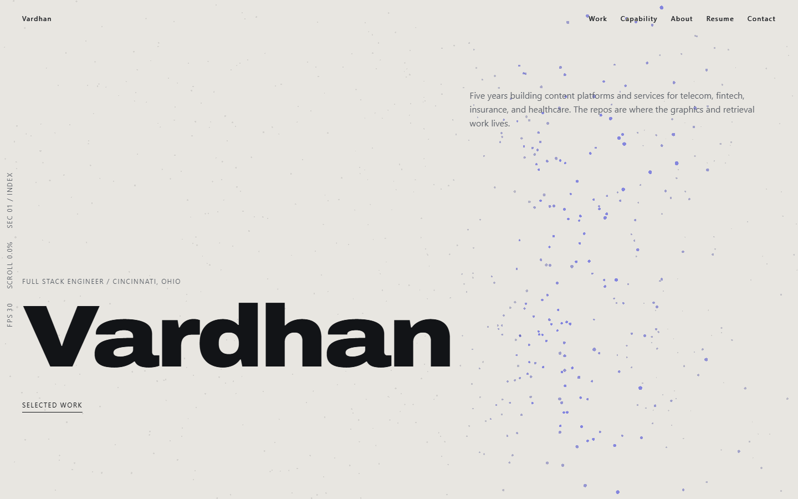
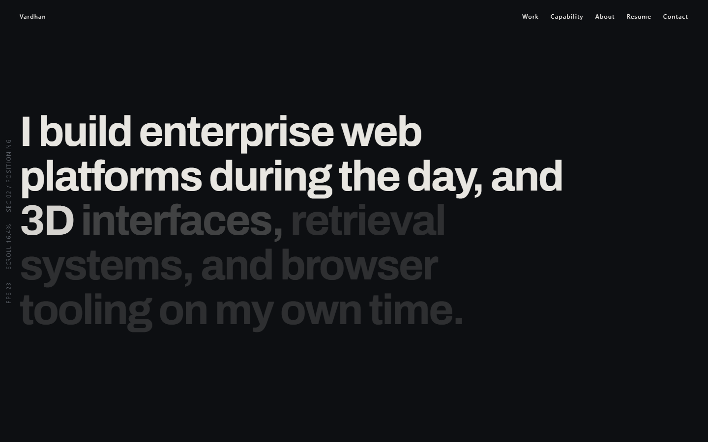
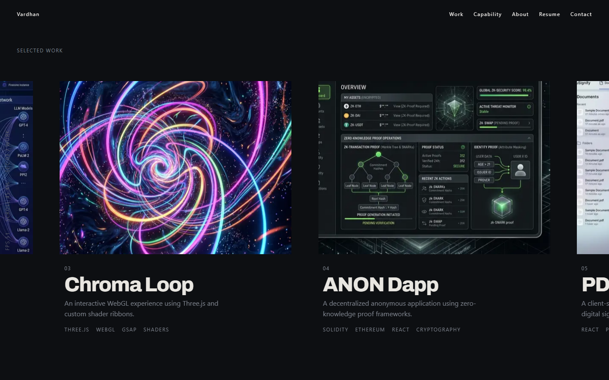

<div align="center">

# vardhansudo.me

**A portfolio built as an instrument panel that reads out its own state.**

Precise hairline grids, monospace telemetry, one accent colour, and scroll choreography that is linked to the scrollbar rather than triggered by it.

[**Live site**](https://vardhansudo.me) · [Design tokens](#design-system) · [Architecture](#architecture) · [Run it locally](#running-it)

</div>

<br />



<br />

---

## The idea

Most developer portfolios borrow their visual language from somewhere else: a template, a dribbble shot, a component kit. This one takes its language from the work itself.

The page presents as an instrument reading out its own state. A persistent rail fixed to the left edge reports which section you are in, how far through the document you have scrolled, and the live frame rate:

```
SEC 03 / WORK        SCROLL 42.7%        FPS 60
```

Every one of those numbers is real. The section comes from a bounds check against the viewport centre, the scroll percentage from the smooth-scroll engine's own progress value, and the frame rate from an actual `requestAnimationFrame` counter on a rolling one-second window. Nothing is a decorative animation pretending to be data.

Everything else stays deliberately quiet so that one element can carry the personality.

---

## The tonal arc

The page begins on paper, turns to void as you enter the work, and returns to paper for contact. The transition is not a theme toggle. It is scrubbed against scroll position across a pinned section, so the page darkens exactly as fast as you move through it.

<table>
<tr>
<td width="50%"></td>
<td width="50%"></td>
</tr>
<tr>
<td><sub><b>Positioning</b> · pinned for 120vh. Word opacity scrubs from 0.15 to 1.0 sequentially, so the sentence is read at whatever pace you scroll. The background interpolates paper to void across the same pin.</sub></td>
<td><sub><b>Selected work</b> · a horizontal track translated on X against vertical scroll. Media parallaxes faster than the track, text slower, creating depth inside the horizontal move.</sub></td>
</tr>
</table>

---

## Design system

Nothing in the codebase uses a value outside this list. The tokens live in a single `@theme` block in [`src/app/globals.css`](src/app/globals.css) and generate their own utility classes.

### Colour

| Token | Value | Role |
| --- | --- | --- |
| `--paper` | `#E8E6E1` | Base background, cool bone |
| `--void` | `#0D0F12` | Dark section background |
| `--ink` | `#121417` | Primary text on paper |
| `--bone` | `#E8E6E1` | Primary text on void |
| `--graphite` | `#5A5F66` | Secondary text on paper |
| `--graphite-void` | `#7E848E` | Secondary text on void |
| `--signal` | `#1F3BFF` | Accent, electric cobalt |

One accent, used on under 5% of the surface. `--graphite-void` exists because `--graphite` measures 2.98:1 against `--void` and fails the 4.5:1 floor; the lighter value clears it at 5.10:1.

### Type

- **Display** — Archivo variable, width axis 118, weight 700–900, tracking `-0.03em`. Headlines only.
- **Body** — Geist Sans, weight 400–500, line height 1.55.
- **Utility** — Geist Mono, uppercase, tracking `0.12em`. Labels, eyebrows, the instrument rail.

Sizes are fluid via `clamp()`, from `--t-mono` at `0.75rem` up to `--t-display` at `clamp(3.5rem, 11vw, 11rem)`.

### Motion

| Token | Value |
| --- | --- |
| `--ease-out-expo` | `cubic-bezier(0.16, 1, 0.3, 1)` |
| `--ease-out-quint` | `cubic-bezier(0.22, 1, 0.36, 1)` |
| `--ease-in-out-quart` | `cubic-bezier(0.76, 0, 0.24, 1)` |
| `--dur-micro` | `200ms` |
| `--dur-base` | `700ms` |
| `--dur-reveal` | `1150ms` |
| `--dur-curtain` | `1400ms` |

No duration falls under 200ms or over 1400ms. `ease`, `ease-in-out`, and browser defaults are not used anywhere. `linear` appears only where it belongs: continuous loops and scroll scrubs. Large type is never revealed on opacity alone — it is always masked and translated.

The same easings are mirrored as `CustomEase` curves in [`src/lib/gsap.ts`](src/lib/gsap.ts) so JavaScript animation and CSS cannot drift apart.

### Space

An 8px base, restricted to `8 · 16 · 24 · 40 · 64 · 96 · 160 · 240`. Twelve columns, 24px gutter, 1440px max width.

---

## Architecture

```
src/
├── app/
│   ├── globals.css              Token system, single source of truth
│   ├── layout.tsx               Fonts, entry gate, providers
│   └── api/contact/route.ts     Validated, rate-limited mail endpoint
├── components/
│   ├── EntrySequence.tsx        First-load curtain, real load progress
│   ├── InstrumentRail.tsx       The signature element
│   ├── HeroSection.tsx          Masked line reveal
│   ├── PositioningSection.tsx   Pinned word scrub + tonal arc
│   ├── ProjectsSection.tsx      Horizontal pinned gallery
│   ├── providers/               Single smooth-scroll instance
│   └── webgl/                   Point cloud, one canvas for the page
├── hooks/useReducedMotion.ts
└── lib/gsap.ts                  Central plugin registration
```

### Notes worth knowing

**One scroll engine, one ticker.** Lenis drives `lenis.raf` from the GSAP ticker so both run on a single `requestAnimationFrame` loop, with lag smoothing disabled. `ScrollTrigger.scrollerProxy` is deliberately *not* used: Lenis scrolls `window`, so ScrollTrigger reads real scroll position, and proxying it introduces pin-offset bugs.

**The rail bypasses React on purpose.** It updates every frame. Sixty re-renders a second would be the single worst thing on the page for interaction latency, so values are written straight to `textContent` through refs from inside one loop. It is `aria-hidden`, because a live region changing sixty times a second makes a screen reader unusable.

**The entry sequence measures real load progress.** The browser exposes no bytes-remaining figure for a page still streaming, so progress advances on three genuine milestones — fonts decoded, images decoded, window load — weighted by their share of perceived load. Timing is derived rather than guessed: content must be interactive by 2200ms and the curtain runs 1400ms starting the hero at 60%, which caps the counter phase at 1360ms.

**The tonal arc is one owner at a time.** Two scrubbed segments write the same custom properties, so the second stays silent at progress 0 rather than stamping its start colour over the hero.

---

## Accessibility

Verified by [`scripts/audit.mjs`](scripts/audit.mjs), which drives a real browser and asserts 25 checks:

- Contrast at or above 4.5:1 for body text on both palettes
- One `h1`, no skipped heading levels, real landmarks, alt text on every image
- Full keyboard traversal with a visible `--signal` focus ring on every stop, applied instantly rather than faded in
- `prefers-reduced-motion: reduce` creates **no** pins, **no** scroll scrubs, never constructs the smooth-scroll engine, and never mounts the canvas — every section stays fully readable at final position

Reduced motion is handled per section as each was built, not retrofitted at the end.

```bash
node scripts/audit.mjs http://localhost:3000
```

The horizontal gallery falls back to a vertical stack below 768px, where a pinned horizontal scroll cannot be made properly reachable.

---

## Performance

| Metric | Measured | Budget |
| --- | --- | --- |
| Largest Contentful Paint | 1.2s | < 2.5s |
| Cumulative Layout Shift | 0 | < 0.05 |
| First-load JavaScript | 166kB | < 250kB |

Only `transform` and `opacity` are animated on scroll. The canvas caps device pixel ratio at 2, mounts only near the viewport, unmounts on tab blur, and is skipped entirely on mobile and under reduced motion. The 3D layer is dynamically imported so it never touches the first load.

---

## Running it

```bash
npm install
npm run dev
```

For an accurate picture, use a production build — the development overlay and hot-reload socket both distort measurements:

```bash
npm run build && npm start
```

### Environment

Create `.env.local`:

```bash
RESEND_API_KEY=re_...
CONTACT_TO_EMAIL=you@example.com
CONTACT_FROM_EMAIL=Portfolio <hello@yourdomain.com>
```

Without these the contact endpoint returns 503 and the form says so plainly. A form that silently does nothing is worse than no form.

### Tooling

```bash
node scripts/shoot.mjs <url> <outDir> [--reduced]   # every section at 0/50/100%, 1440px and 390px
node scripts/audit.mjs <url>                        # 25 accessibility and reduced-motion checks
```

`shoot.mjs` measures the pin spacer rather than the section for pinned content, otherwise the entire scrubbed range goes uncaptured.

---

## Stack

Next.js (App Router) · TypeScript · Tailwind CSS v4 · GSAP + ScrollTrigger · Lenis · SplitType · react-three-fiber · Resend

---

<div align="center">
<sub>Built by <a href="https://github.com/grammerpro">Vardhan</a> · Cincinnati, Ohio</sub>
</div>
