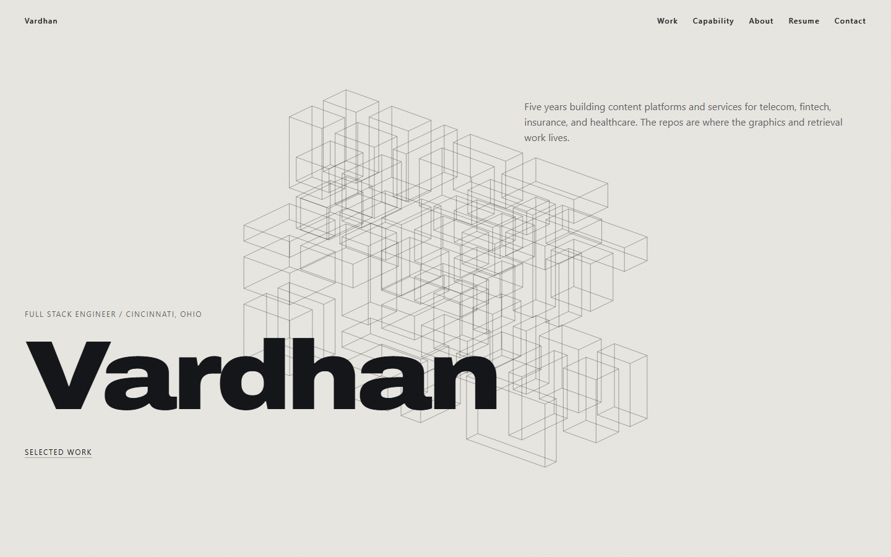
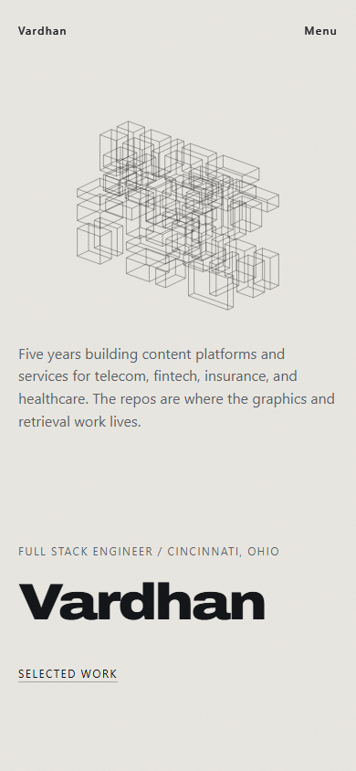

# Before / after review

The before images are actual local production and live-site captures from September 27, 2026. The after images are the implemented local production redesign, captured at the same desktop and phone sizes. They are browser renders, not mockups. The original deployment was not replaced.

## Desktop, 1440 × 900

Before:

After:

The original local version already had a dimensional wireframe structure and strong typography. The redesign gives that identity a solid, beveled material silhouette and a continuous spatial role. Immediate work/résumé links remain beside the identity. The loading/static plate is captured from the same renderer, so the opening retains its composition without WebGL.

## Phone, 390 × 844

Before:

After:

The new phone composition places identity and actions first, with a smaller sculpture below. Main navigation stays visible, and projects form a vertical sequence. An initial overlap between the sculpture and action row was found during development and fixed by reframing the narrow scene and regenerating its matched poster.

## Beyond the opening

The entrance has real camera translation through an empty aperture; raycasts across 401 sampled states in each composition find no assembly intersection. Source-grounded HTML remains readable beside the scene. Three exhibits provide different interactions instead of repeating a thumbnail grid. The capability map has selectable details and a full text alternative. Contact keeps the original email/social destinations, accepted-provider response contract, and graceful retry.

## Internal review scale

This is an internal design judgment, not an external rating. **1** means a material gap, **2** partial coverage, **3** a useful baseline, **4** strong implementation with documented limits, **5** exceptional polish and comprehensive evidence. Scores assess the observed local captures and recorded tests; they do not imply measured business results or universal device performance.

| Dimension | Weight | Before | After | Basis |
| --- | ---: | ---: | ---: | --- |
| Visual identity | 20% | 3 | 4 | Solid original signature, material response, coordinated warm/dark typography and framing |
| Spatial storytelling | 20% | 2 | 4 | Exploded assembly, true aperture passage, gallery rails and contact reassembly replace largely separate visual beats |
| Engineering credibility | 20% | 2 | 4 | Audited source, six case routes, explicit prototype/scaffold limits; older incorrect stack claims removed |
| Navigation/usability | 15% | 3 | 4 | Persistent direct links, native scrolling, case history, accessible controls, printable résumé |
| Mobile/accessibility | 15% | 3 | 4 | Separate mobile composition, reduced motion, fallback, keyboard, reflow and two-engine checks; no real iOS certification |
| Performance/resilience | 10% | 3 | 4 | Deferred demand rendering and documented tests/budgets; baseline timing was not measured, so no speedup claim |

Weighted internal review: before **2.60/5**, after **4.00/5**. The before performance score reflects observed functional baseline quality only; it is not a timing comparison. The after score includes known limits in [verification](verification.md), and a higher total does not waive those limits.

## Preservation and tradeoffs

- All six original source destinations, `/projects`, `/resume`, original PDF, section anchors, social destinations, and provider integrations remain accessible.
- The PDF project moved to the archive because the inspected repository contains a CLI scaffold. ANON provides a more substantive third featured case study. This follows the brief’s evidence-based selection rule.
- Legacy promotional images remain on disk, but those contradicting source code are not shown as product evidence. Real local-build captures and labeled diagrams take their place.
- Ten stale fit evidence entries are withheld until the owner reviews revised content and deliberately rebuilds embeddings. This narrows project/education matching; it avoids continuing unsupported claims. Professional evidence and the existing Gemini flow remain available. This is a documented content-quality tradeoff, not a silent removal.
- Expensive effects and continuous ambient loops were omitted. Real materials, camera travel, interaction and fallback remain. No production FPS or loading improvement over the baseline is claimed without comparable measurements.
- The contact/model checks used mocks. Successful email delivery, provider quotas, real mobile GPUs and actual Safari/iOS remain outside this local review.
